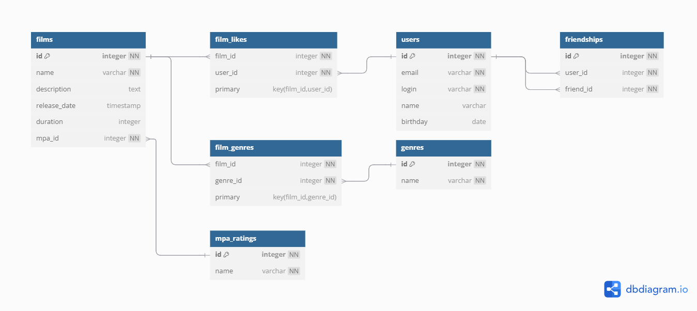

# java-filmorate
Template repository for Filmorate project.

Схема базы данных:


## Пример SQL-запроса

Следующий запрос получает информацию о фильмах с их жанрами, рейтингами MPA и лайкнувшими пользователями:

```sql
SELECT
  f.name AS film_name,
  f.description,
  g.name AS genre_name,
  mr.name AS mpa_rating,
  u.name AS user_name,
  uf.name AS friend_name
FROM films f
  LEFT JOIN film_genres fg ON f.id = fg.film_id
  LEFT JOIN genres g ON fg.genre_id = g.id
  LEFT JOIN film_likes fl ON f.id = fl.film_id
  LEFT JOIN users u ON fl.user_id = u.id
  LEFT JOIN friendships fr ON u.id = fr.user_id
  LEFT JOIN users uf ON fr.friend_id = uf.user_id
  LEFT JOIN mpa_rating mr ON f.mpa_id = mr.id;
```